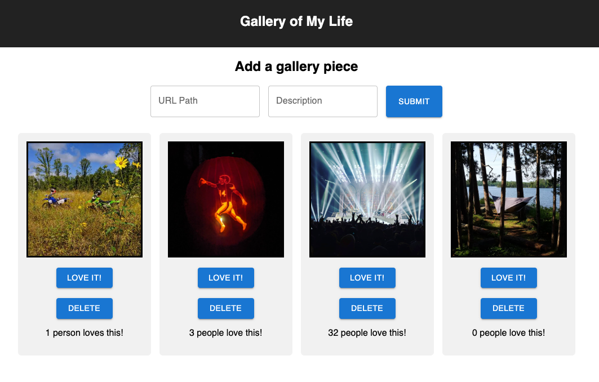

# Weekend React Gallery

## Description

This image gallery allows the user to upload images and descriptions to a database and those images are displayed on a webpage. Once an image is loaded the user can either like the image to increment its like counter or delete the image to remove it from the database. This allows the user to display and curate import photographs for all to see.

## Sample Image

## Installation

1. Fork and clone this repository.
2. Create a database named "react_gallery".
3. Run the SQL queries in the database.sql file to set up a table and populate it. This project was made with Postgres and Postico and will work nicely with that duo.
4. From your terminal run 'npm install'.
5. Then run 'npm run server' and 'npm run client' within separate terminal instances. This should automatically open a window in your browser.

## Built With
- React
- Javascript
- CSS
- Node.js
- Express
- HTML
- PostgreSQL
- Material UI